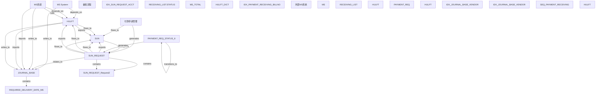

# AP Business Flow

```mermaid
flowchart TD
    ent_system_external_system_ms_["MS System"]
    ent_data_table_journal_base["JOURNAL_BASE"]
    ent_business_business_process_["付款申请审批流程"]
    ent_system_external_system_sun["SUN ERP"]
    ent_data_table_sun_request["SUN_REQUEST"]
    ent_system_external_system_ms系["MS系统"]
    ent_system_service_hulft["HULFT"]
    ent_business_business_process_["応付管理流程"]
    ent_business_business_step_審批流["審批流程"]
    ent_data_column_required_deliv["REQUIRED_DELIVERY_DATE_MS"]
    ent_data_view_idx_sun_request_["IDX_SUN_REQUEST_ACCT"]
    ent_data_status_receiving_list["RECEIVING_LIST_STATUS_1"]
    ent_data_status_payment_req_st["PAYMENT_REQ_STATUS_3"]
    ent_business_business_object_s["SUN_REQUEST_Request1"]
    ent_data_column_ms_total["MS_TOTAL"]
    ent_data_status_payment_req_st["PAYMENT_REQ_STATUS_1"]
    ent_data_status_payment_req_st["PAYMENT_REQ_STATUS_2"]
    ent_data_status_payment_req_st["PAYMENT_REQ_STATUS_4"]
    ent_data_table_hulft_dict["HULFT_DICT"]
    ent_data_table_idx_payment_rec["IDX_PAYMENT_RECEIVING_BILLNO"]
    ent_system_external_system_外部m["外部MS系统"]
    ent_data_status_payment_req_st["PAYMENT_REQ_STATUS"]
    ent_system_external_system_ms["MS"]
    ent_system_external_system_sun["SUN"]
    ent_business_business_process_["付款申请业务流程"]
    ent_data_table_receiving_list["RECEIVING_LIST"]
    ent_business_business_process_["付款申请管理"]
    ent_system_system_hulft["HULFT"]
    ent_data_table_payment_req["PAYMENT_REQ"]
    ent_system_external_system_ms系["MS系統"]
    ent_system_external_system_hul["HULFT"]
    ent_business_business_object_s["SUN_REQUEST_Request2"]
    ent_data_status_payment_req_st["PAYMENT_REQ_STATUS_5"]
    ent_data_status_payment_req_st["PAYMENT_REQ_STATUS_6"]
    ent_system_class_idx_journal_b["IDX_JOURNAL_BASE_VENDOR"]
    ent_data_table_idx_journal_bas["IDX_JOURNAL_BASE_VENDOR"]
    ent_system_class_seq_payment_r["SEQ_PAYMENT_REQ"]
    ent_system_class_seq_payment_r["SEQ_PAYMENT_RECEIVING"]
    ent_data_status_receiving_list["RECEIVING_LIST.STATUS"]
    ent_system_interface_hulft["HULFT"]

    ent_system_external_system_ms_ -->|writes_to| ent_data_table_journal_base
    ent_system_external_system_ms_ -->|depends_on| ent_system_service_hulft
    ent_data_table_journal_base -->|contains| ent_data_column_required_deliv
    ent_business_business_process_ -->|generates| ent_data_table_sun_request
    ent_business_business_process_ -->|flows_to| ent_system_external_system_sun
    ent_system_external_system_sun -->|reads_from| ent_data_table_sun_request
    ent_data_table_sun_request -->|exports| ent_system_external_system_sun
    ent_data_table_sun_request -->|flows_to| ent_system_external_system_sun
    ent_data_table_sun_request -->|contains| ent_business_business_object_s
    ent_data_table_sun_request -->|flows_to| ent_system_service_hulft
    ent_data_table_sun_request -->|exports| ent_system_service_hulft
    ent_data_table_sun_request -->|relates_to| ent_data_table_journal_base
    ent_data_table_sun_request -->|flows_to| ent_system_external_system_sun
    ent_data_table_sun_request -->|contains| ent_business_business_object_s
    ent_system_external_system_ms系 -->|depends_on| ent_system_service_hulft
    ent_system_external_system_ms系 -->|calls| ent_system_service_hulft
    ent_system_external_system_ms系 -->|writes_to| ent_data_table_journal_base
    ent_system_external_system_ms系 -->|imports| ent_data_table_journal_base
    ent_system_service_hulft -->|imports| ent_data_table_journal_base
    ent_system_service_hulft -->|writes_to| ent_data_table_journal_base
    ent_system_service_hulft -->|flows_to| ent_system_external_system_sun
    ent_system_service_hulft -->|exports| ent_system_external_system_sun
    ent_data_status_payment_req_st -->|generates| ent_data_table_sun_request
    ent_data_status_payment_req_st -->|transitions_to| ent_data_status_payment_req_st
```
