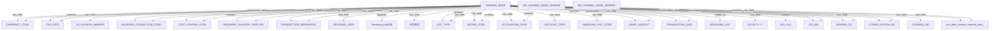

# JOURNAL_BASE Subgraph

```mermaid
flowchart TD
    ent_data_table_journal_base["JOURNAL_BASE"]
    ent_data_column_currency_code["CURRENCY_CODE"]
    ent_data_column_tax_rate["TAX_RATE"]
    ent_data_column_allocation_mar["ALLOCATION_MARKER"]
    ent_data_column_business_conne["BUSINESS_CONNECTION_CODE"]
    ent_data_column_cost_center_co["COST_CENTER_CODE"]
    ent_data_column_required_deliv["REQUIRED_DELIVERY_DATE_MS"]
    ent_data_column_transaction_re["TRANSACTION_REFERENCE"]
    ent_data_column_received_date["RECEIVED_DATE"]
    ent_business_business_process_["Receiving List生成"]
    ent_data_field_注文番号["注文番号"]
    ent_data_column_list_type["LIST_TYPE"]
    ent_data_column_buyer_code["BUYER_CODE"]
    ent_data_column_accounting_dat["ACCOUNTING_DATE"]
    ent_data_column_account_code["ACCOUNT_CODE"]
    ent_data_column_handling_unit_["HANDLING_UNIT_CODE"]
    ent_data_column_memo_amount["MEMO_AMOUNT"]
    ent_data_column_transaction_da["TRANSACTION_DATE"]
    ent_data_table_receiving_list["RECEIVING_LIST"]
    ent_data_field_仕入先コード["仕入先コード"]
    ent_data_column_del_flg["DEL_FLG"]
    ent_data_column_cpl_mk["CPL_MK"]
    ent_data_column_vendor_cd["VENDOR_CD"]
    ent_data_column_other_system_n["OTHER_SYSTEM_NO"]
    ent_data_column_journal_no["JOURNAL_NO"]
    ent_system_class_idx_journal_b["IDX_JOURNAL_BASE_VENDOR"]
    ent_data_table_idx_journal_bas["IDX_JOURNAL_BASE_VENDOR"]

    ent_data_table_journal_base -->|has_field| ent_data_column_currency_code
    ent_data_table_journal_base -->|contains| ent_data_column_currency_code
    ent_data_table_journal_base -->|has_field| ent_data_column_tax_rate
    ent_data_table_journal_base -->|contains| ent_data_column_tax_rate
    ent_data_table_journal_base -->|has_field| ent_data_column_allocation_mar
    ent_data_table_journal_base -->|contains| ent_data_column_business_conne
    ent_data_table_journal_base -->|has_field| ent_data_column_business_conne
    ent_data_table_journal_base -->|contains| ent_data_column_cost_center_co
    ent_data_table_journal_base -->|has_field| ent_data_column_cost_center_co
    ent_data_table_journal_base -->|contains| ent_data_column_required_deliv
    ent_data_table_journal_base -->|has_field| ent_data_column_required_deliv
    ent_data_table_journal_base -->|contains| ent_data_column_transaction_re
    ent_data_table_journal_base -->|has_field| ent_data_column_transaction_re
    ent_data_table_journal_base -->|has_field| ent_data_column_received_date
    ent_data_table_journal_base -->|supports| ent_business_business_process_
    ent_data_table_journal_base -->|has_field| ent_data_field_注文番号
    ent_data_table_journal_base -->|contains| ent_data_column_list_type
    ent_data_table_journal_base -->|has_field| ent_data_column_list_type
    ent_data_table_journal_base -->|has_field| ent_data_column_buyer_code
    ent_data_table_journal_base -->|contains| ent_data_column_buyer_code
    ent_data_table_journal_base -->|has_field| ent_data_column_accounting_dat
    ent_data_table_journal_base -->|contains| ent_data_column_accounting_dat
    ent_data_table_journal_base -->|has_field| ent_data_column_account_code
    ent_data_table_journal_base -->|has_field| ent_data_column_handling_unit_
    ent_data_table_journal_base -->|contains| ent_data_column_memo_amount
    ent_data_table_journal_base -->|has_field| ent_data_column_memo_amount
    ent_data_table_journal_base -->|contains| ent_data_column_transaction_da
    ent_data_table_journal_base -->|has_field| ent_data_column_transaction_da
    ent_data_table_journal_base -->|relates_to| ent_data_table_receiving_list
    ent_data_table_journal_base -->|has_field| ent_data_field_仕入先コード
    ent_data_table_journal_base -->|contains| ent_data_column_del_flg
    ent_data_table_journal_base -->|contains| ent_data_column_cpl_mk
    ent_data_table_journal_base -->|has_field| ent_data_column_cpl_mk
    ent_data_table_journal_base -->|has_field| ent_data_column_vendor_cd
    ent_data_table_journal_base -->|contains| ent_data_column_vendor_cd
    ent_data_table_journal_base -->|contains| ent_data_column_other_system_n
    ent_data_table_journal_base -->|has_field| ent_data_column_other_system_n
    ent_data_table_journal_base -->|has_field| ent_data_column_journal_no
    ent_data_table_journal_base -->|contains| ent_data_column_material_item_
    ent_data_table_journal_base -->|has_field| ent_data_column_material_item_
```
