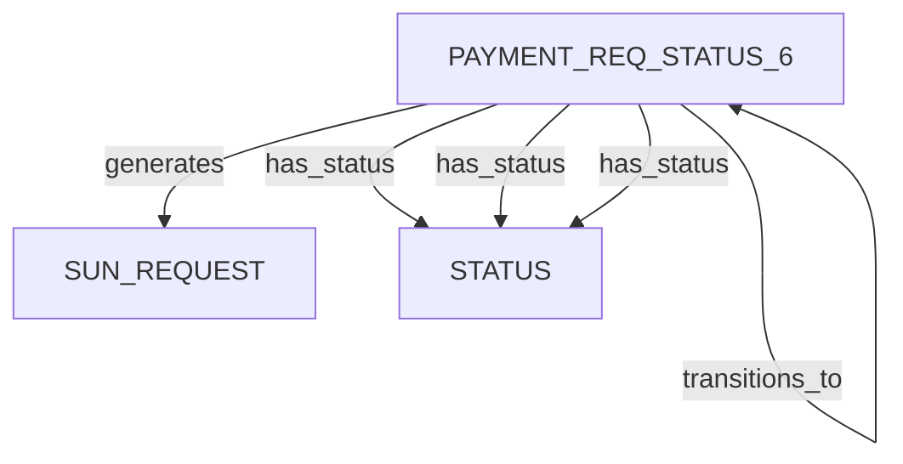

# PAYMENT_REQ Subgraph

```mermaid
flowchart TD
    ent_data_status_payment_req_st["PAYMENT_REQ_STATUS_3"]
    ent_data_table_sun_request["SUN_REQUEST"]
    ent_data_status_payment_req_st["PAYMENT_REQ_STATUS_5"]
    ent_data_column_status["STATUS"]
    ent_data_status_payment_req_st["PAYMENT_REQ_STATUS_2"]
    ent_data_status_payment_req_st["PAYMENT_REQ_STATUS_1"]
    ent_data_status_payment_req_st["PAYMENT_REQ_STATUS_4"]
    ent_data_status_payment_req_st["PAYMENT_REQ_STATUS_6"]

    ent_data_status_payment_req_st -->|generates| ent_data_table_sun_request
    ent_data_status_payment_req_st -->|transitions_to| ent_data_status_payment_req_st
    ent_data_status_payment_req_st -->|has_status| ent_data_column_status
    ent_data_status_payment_req_st -->|transitions_to| ent_data_status_payment_req_st
    ent_data_status_payment_req_st -->|transitions_to| ent_data_status_payment_req_st
    ent_data_status_payment_req_st -->|has_status| ent_data_column_status
    ent_data_status_payment_req_st -->|transitions_to| ent_data_status_payment_req_st
    ent_data_status_payment_req_st -->|transitions_to| ent_data_status_payment_req_st
    ent_data_status_payment_req_st -->|transitions_to| ent_data_status_payment_req_st
    ent_data_status_payment_req_st -->|has_status| ent_data_column_status
    ent_data_status_payment_req_st -->|transitions_to| ent_data_status_payment_req_st
```
