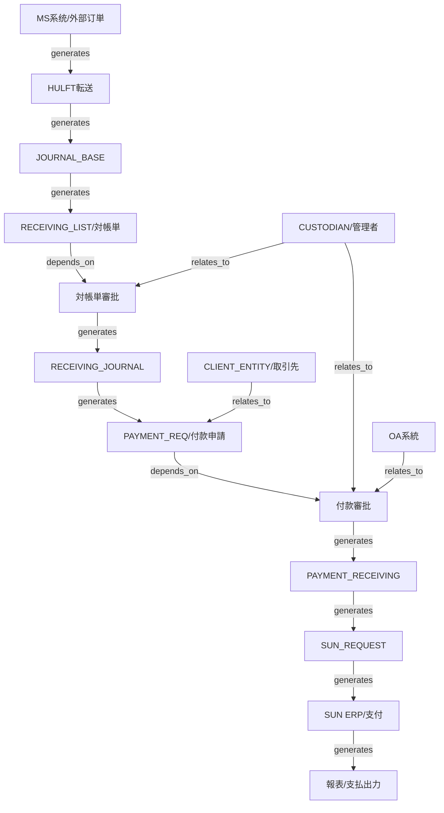

# Q4 Semantic Map

```mermaid
flowchart TD
    ms_system["MS系统/外部订単"]
    hulft["HULFT転送"]
    journal_base["JOURNAL_BASE"]
    receiving_list["RECEIVING_LIST/対帳単"]
    receiving_journal["RECEIVING_JOURNAL"]
    approval_1["対帳単審批"]
    payment_req["PAYMENT_REQ/付款申請"]
    approval_2["付款審批"]
    payment_receiving["PAYMENT_RECEIVING"]
    sun_request["SUN_REQUEST"]
    sun_erp["SUN ERP/支付"]
    report["報表/支払出力"]
    custodian["CUSTODIAN/管理者"]
    client_entity["CLIENT_ENTITY/取引先"]
    oa_system["OA系統"]

    ms_system -->|generates| hulft
    hulft -->|generates| journal_base
    journal_base -->|generates| receiving_list
    receiving_list -->|depends_on| approval_1
    approval_1 -->|generates| receiving_journal
    receiving_journal -->|generates| payment_req
    payment_req -->|depends_on| approval_2
    approval_2 -->|generates| payment_receiving
    payment_receiving -->|generates| sun_request
    sun_request -->|generates| sun_erp
    sun_erp -->|generates| report
    custodian -->|relates_to| approval_1
    custodian -->|relates_to| approval_2
    client_entity -->|relates_to| payment_req
    oa_system -->|relates_to| approval_2
```
