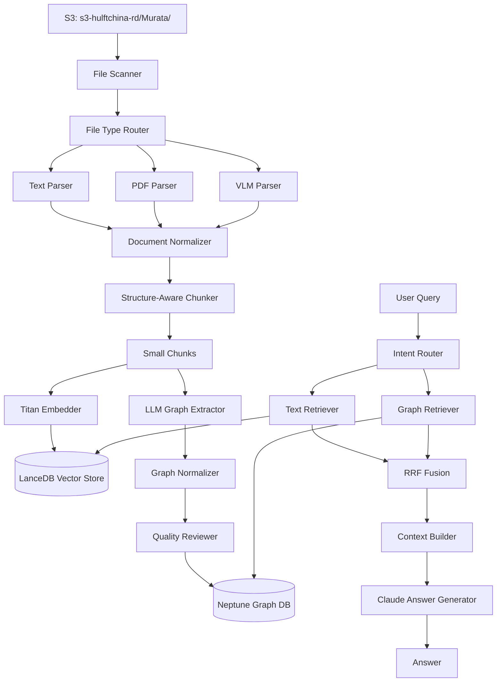
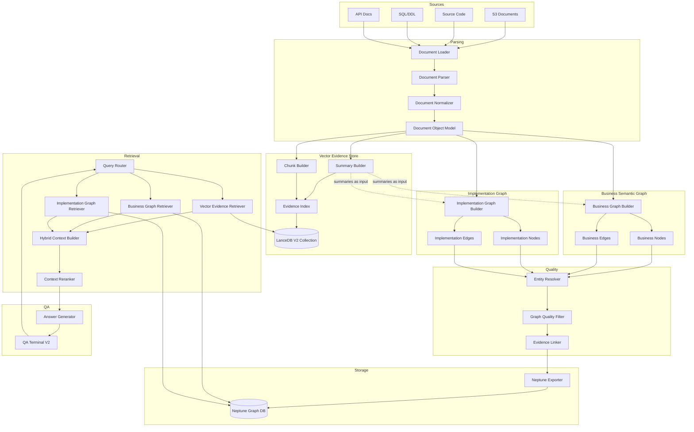

# V2 Refactor Plan: Business Semantic Graph + Implementation Graph + Vector Evidence Store

**Date:** 2026-05-19  
**Stage:** 02 — V2 Refactor Plan  
**Run ID:** murata_semantic_v2  
**Dataset:** murata  
**Generated by:** Hermes Agent

---

## 1. Executive Summary

### Current State

The current system is a **chunk-driven dual-path RAG** where:

- Documents are parsed → chunked → embedded into LanceDB (vector path)
- The same small chunks are sent to Claude for entity/relation extraction → normalized → loaded into Neptune (graph path)
- At query time, vector topK and graph results are fused via RRF and passed to the answer generator

### Target State

The V2 architecture separates into three distinct layers:

```
Business Semantic Graph + Implementation Graph + Vector Evidence Store
```

Where:

- **Vector Evidence Store** is chunk/evidence-centric — stores document summaries, section chunks, small evidence chunks, table chunks, code chunks, SQL chunks, and API chunks for semantic retrieval and citation
- **Business Semantic Graph** is business entity/relation-centric — models domains, processes, steps, rules, terms, functions, screens, roles, and organizations
- **Implementation Graph** is system/API/code/DB entity/relation-centric — models systems, modules, APIs, services, classes, methods, tables, columns, SQL, jobs, files, configs, and external systems
- **Evidence Linker** connects every graph node and edge back to evidence chunks via `evidence_chunk_ids` and `HAS_EVIDENCE` edges
- **Graph extraction is NOT from all small chunks** — it uses document summaries, section summaries, business documents, API docs, DDL, and source code as primary extraction sources

### Key Principle

The graph should no longer be built by blindly extracting from all small chunks. Small chunks serve as evidence (stored in Vector Evidence Store), while graph extraction uses higher-level summaries and structured documents as input.

---

## 2. Current Architecture Summary

### Module Tree

```
src/hermes_bedrock_agent/          # Main package (18,662 LOC)
├── schemas/                       # Pydantic models (graph, chunk, document, retrieval, visual)
├── parsers/                       # PDF, text, VLM, image, merge
├── chunking/                      # Structure-aware chunker
├── embedding/                     # Titan v2 embedder
├── vector_store/                  # LanceDB + OpenSearch backends
├── graph/                         # Extractor, normalizer, quality_review, neptune_loader
├── retrieval/                     # Intent router, text/graph retrievers, fusion, context builder
├── generation/                    # Claude answer generator
├── clients/                       # Bedrock, Neptune, S3, OpenSearch
├── ingestion/                     # Pipeline orchestration
├── s3_graph_etl/                  # Full S3 ETL pipeline
└── configs/                       # Logging, settings

semantic_map_workflow/              # Newer module (layer-aware schemas)
├── semantic_map/
│   ├── schemas.py                 # NodeSchema, EdgeSchema with Cypher helpers
│   ├── constants.py               # LAYERS, CATEGORIES, RELATIONSHIP_TYPES
│   ├── chunker.py                 # Java/SQL/XML-aware chunker
│   ├── validators.py              # Entity validation
│   ├── evidence_utils.py          # Evidence handling
│   └── ...

scripts/                           # Pipeline scripts (~30 files)
├── run_e2e_murata_pipeline.py     # Full E2E orchestrator (2329 LOC)
├── qa_terminal.py                 # Interactive QA (949 LOC)
├── phase1_extract.py              # Document extraction
├── phase2_embed.py                # Embedding
├── phase3_neptune.py              # Neptune loading
└── ...
```

### Current Flow Diagram



### Current Flows

| Flow | Current Implementation |
|------|----------------------|
| Document parsing | S3 scan → file router → parser (text/PDF/VLM) → NormalizedDocument |
| Chunking | NormalizedDocument → structure-aware chunker → DocumentChunk (1500 chars, 200 overlap) |
| Vector store | DocumentChunk → Titan embed → LanceDB local store |
| Graph extraction | DocumentChunk → Claude LLM → entities/relations per chunk (max 8/12) |
| Neptune loading | GraphEntity/GraphRelation → normalizer → quality_review → parameterized Cypher MERGE |
| QA/retrieval | Query → intent classify → text retriever + graph retriever → RRF fusion → context builder → Claude answer |

---

## 3. V1 Problems to Solve

### Problem 1: Graph extraction is too chunk-driven

The current extractor processes every chunk through Claude LLM extraction. This means:
- 8 entities max per chunk × hundreds of chunks = hundreds of fragmented entities
- Each chunk only sees ~1500 characters of context
- Entity quality degrades for small/noisy chunks

### Problem 2: Small chunks produce fragmented entity relations

Relations extracted from individual chunks lack cross-document context. A business process that spans 5 sections appears as 5 disconnected fragments.

### Problem 3: Graph layer is not clearly separated

V1 uses a single mixed graph with labels like "system", "process", "table", "role" all in one Neptune namespace. There is no structural separation of business concepts from implementation details.

### Problem 4: Business semantic graph and implementation graph are mixed

A query about "payment business process" returns graph paths mixing Business entities (roles, processes) with Implementation entities (tables, APIs, SQL) without clear layer boundaries.

### Problem 5: Evidence layer is not explicitly modeled

Evidence linking in V1 is `source_chunk_ids` as a string list property on entities. There are no explicit EvidenceChunk nodes or HAS_EVIDENCE edges for graph traversal.

### Problem 6: Schema is insufficient for V2

V1 has 20 EntityType values (some irrelevant: "concept", "event", "field"). V2 requires 30+ typed labels across two layers plus evidence layer labels.

### Problem 7: Retrieval mixes vector topK and graph topK too directly

V1 fusion uses a simple RRF (k=60, text_weight=0.6, graph_weight=0.4) without layer-aware routing. All queries get the same text+graph blend regardless of whether they're asking about business structure or system architecture.

---

## 4. Target V2 Architecture

### Architecture Diagram



### Key Design Choices

1. **Summary-first graph extraction** — Document and section summaries are generated first, then used as primary input for business/implementation graph builders
2. **Separate graph builders** — Business Graph Builder uses business docs, process docs, user manuals; Implementation Graph Builder uses API docs, DDL, source code, SQL
3. **Evidence linker as post-processing** — After graph construction, link every node/edge back to the evidence chunks that support them
4. **Layer-scoped retrieval** — Query Router determines which layers to query primarily based on intent classification

---

## 5. Existing Module Reuse Plan

| V2 Responsibility | Existing Candidate Module | Reuse / Modify / New | Reason | Risk |
|---|---|---|---|---|
| Document loading (S3) | `src/.../ingestion/` + `src/.../clients/s3_client.py` | Reuse | S3 scan and file routing work well | Low |
| Document parsing | `src/.../parsers/` (text, PDF, VLM, image, merge) | Reuse | All parsers are solid, tested | Low |
| Document normalization | `src/.../ingestion/` NormalizedDocument pipeline | Reuse | Produces clean text + metadata | Low |
| Chunking (structure-aware) | `src/.../chunking/chunker.py` | Reuse | Good section/page/code awareness | Low |
| Chunking (Java/SQL/XML) | `semantic_map_workflow/.../chunker.py` | Reuse | Better for structured code files | Low |
| Summary generation | — | New | V1 has summary for code_evidence only; V2 needs doc+section summaries | Medium |
| Embedding | `src/.../embedding/embedder.py` | Reuse | Titan v2, 1024 dims, works perfectly | Low |
| Vector store | `src/.../vector_store/lancedb_store.py` | Reuse | LanceDB backend unchanged; new collection name | Low |
| Bedrock client | `src/.../clients/bedrock_client.py` | Reuse | Converse API wrapper works | Low |
| Neptune client | `src/.../clients/neptune_client.py` | Reuse | SigV4 + parameterized Cypher | Low |
| S3 client | `src/.../clients/s3_client.py` | Reuse | Standard boto3 wrapper | Low |
| Graph extraction (LLM) | `src/.../graph/extractor.py` | Modify | Needs layer-aware schema-constrained prompts; keep core logic | Medium |
| Graph normalizer | `src/.../graph/normalizer.py` | Reuse | Core dedup/canonical logic solid | Low |
| Graph quality reviewer | `src/.../graph/quality_review.py` | Modify | Expand schema registry for V2 labels | Low |
| Neptune loader | `src/.../graph/neptune_loader.py` | Reuse | Already supports dry-run + Cypher export + parameterized queries | Low |
| Graph retriever | `src/.../retrieval/graph_retriever.py` | Modify | Add layer-scoped Cypher queries (business vs implementation) | Medium |
| Vector retriever | `src/.../retrieval/text_retriever.py` | Reuse | LanceDB cosine search unchanged | Low |
| Context builder | `src/.../retrieval/context_builder.py` | Modify | Add [Business Graph Context] / [Implementation Graph Context] / [Evidence Context] structure | Medium |
| Intent router | `src/.../retrieval/intent_router.py` | Modify | Add V2 query types: business_process, api_code, workflow_gen, impact_analysis | Low |
| Query entity extractor | `src/.../retrieval/query_entity_extractor.py` | Reuse | CJK-aware entity extraction works | Low |
| RRF fusion | `src/.../retrieval/fusion.py` | Modify | Layer-aware weighting instead of flat 0.6/0.4 | Medium |
| QA terminal | `scripts/qa_terminal.py` | Modify | V2 terminal with debug output and layer visibility | Medium |
| semantic_map constants | `semantic_map_workflow/.../constants.py` | Reference | Layer constants, confidence bands, Murata module mapping | Low |
| semantic_map schemas | `semantic_map_workflow/.../schemas.py` | Reference | NodeSchema/EdgeSchema with validation + Cypher helpers; pattern for V2 | Low |
| semantic_map validators | `semantic_map_workflow/.../validators.py` | Reuse | Entity validation logic | Low |
| semantic_map evidence_utils | `semantic_map_workflow/.../evidence_utils.py` | Reuse | Evidence truncation and confidence boosting | Low |
| Answer generator | `src/.../generation/answer_generator.py` | Reuse | Claude-based answer generation | Low |

### Summary

- **Reuse as-is:** 14 modules (parsers, clients, embedding, vector store, normalizer, entity extractor, answer generator)
- **Modify for V2:** 8 modules (extractor, quality_review, graph_retriever, context_builder, intent_router, fusion, qa_terminal, schema files)
- **New modules:** 10+ new files (summary builder, business graph builder, implementation graph builder, entity resolver, evidence linker, schema definitions, pipeline scripts)

---

## 6. Proposed V2 File and Module Design

### Directory Structure

Given the existing project uses `src/hermes_bedrock_agent/` as the main package and `scripts/` for pipeline entry points, V2 will follow the same pattern with a `v2/` subdirectory to isolate new code:

```
src/hermes_bedrock_agent/
├── v2/                                    # NEW V2 namespace
│   ├── __init__.py
│   ├── schemas/
│   │   ├── __init__.py
│   │   ├── document_schema.py             # DocumentRecord, SectionRecord
│   │   ├── evidence_schema.py             # EvidenceChunk, ChunkType enum
│   │   ├── graph_schema.py                # GraphNode, GraphEdge, layer enums
│   │   ├── retrieval_schema.py            # QueryIntent, RetrievalPlan, HybridContext
│   │   └── qa_schema.py                   # QADebugRecord, E2E test results
│   │
│   ├── evidence/
│   │   ├── __init__.py
│   │   ├── summary_builder.py             # LLM doc+section summary generation
│   │   ├── chunk_builder.py               # V2 multi-type chunk construction
│   │   ├── evidence_store_builder.py      # Orchestrate: chunks → embed → LanceDB
│   │   └── evidence_index.py              # Evidence lookup (chunk_id → text)
│   │
│   ├── graph/
│   │   ├── __init__.py
│   │   ├── schema_registry.py             # Allowed labels/relations per layer
│   │   ├── business_graph_builder.py      # Business layer extraction (summary-first)
│   │   ├── implementation_graph_builder.py # Implementation layer extraction (code/API/DDL)
│   │   ├── entity_resolver.py             # CJK alias mapping + merge
│   │   ├── quality_filter.py              # Schema-valid + confidence + evidence filter
│   │   ├── evidence_linker.py             # Link graph nodes/edges → evidence chunks
│   │   └── graph_exporter.py              # JSONL + Cypher export
│   │
│   ├── retrieval/
│   │   ├── __init__.py
│   │   ├── query_router.py                # Intent → layer-primary retrieval plan
│   │   ├── vector_evidence_retriever.py   # Evidence-centric vector search
│   │   ├── business_graph_retriever.py    # Business layer graph traversal
│   │   ├── implementation_graph_retriever.py # Implementation layer graph traversal
│   │   ├── hybrid_context_builder.py      # [Business] + [Implementation] + [Evidence]
│   │   └── context_reranker.py            # Cross-layer reranking
│   │
│   └── config/
│       ├── __init__.py
│       └── v2_config.py                   # V2 configuration loader
│
scripts/
├── rebuild_murata_v2.py                   # NEW full V2 pipeline orchestrator
├── qa_terminal_v2.py                      # NEW V2 QA terminal
├── load_neptune_v2.py                     # NEW V2 Neptune loader (dry-run + export)
├── build_evidence_store_v2.py             # NEW evidence store builder entry point
├── build_business_graph_v2.py             # NEW business graph builder entry point
├── build_implementation_graph_v2.py       # NEW implementation graph builder entry point
└── ... (existing scripts unchanged)

configs/
├── murata_semantic_v2.yaml                # NEW V2 configuration
└── ... (existing configs unchanged)
```

### File Inventory

| File | Purpose | Depends On | Create / Modify | Stage |
|---|---|---|---|---|
| `src/.../v2/__init__.py` | V2 package init | — | Create | 03 |
| `src/.../v2/schemas/__init__.py` | Schema package | — | Create | 03 |
| `src/.../v2/schemas/document_schema.py` | DocumentRecord, SectionRecord | pydantic | Create | 03 |
| `src/.../v2/schemas/evidence_schema.py` | EvidenceChunk, ChunkType | pydantic | Create | 03 |
| `src/.../v2/schemas/graph_schema.py` | GraphNode, GraphEdge, enums | pydantic | Create | 03 |
| `src/.../v2/schemas/retrieval_schema.py` | QueryIntent, RetrievalPlan, HybridContext | pydantic | Create | 03 |
| `src/.../v2/schemas/qa_schema.py` | QADebugRecord | pydantic | Create | 03 |
| `src/.../v2/evidence/__init__.py` | Evidence package | — | Create | 04 |
| `src/.../v2/evidence/summary_builder.py` | Doc+section LLM summaries | bedrock_client, schemas | Create | 04 |
| `src/.../v2/evidence/chunk_builder.py` | Multi-type chunk construction | chunker, schemas | Create | 04 |
| `src/.../v2/evidence/evidence_store_builder.py` | Orchestrate chunk→embed→store | embedder, lancedb_store | Create | 04 |
| `src/.../v2/evidence/evidence_index.py` | Chunk ID → text lookup | lancedb_store | Create | 04 |
| `src/.../v2/graph/__init__.py` | Graph package | — | Create | 05 |
| `src/.../v2/graph/schema_registry.py` | Allowed labels/relations per layer | constants | Create | 03 |
| `src/.../v2/graph/business_graph_builder.py` | Business graph extraction | bedrock_client, schemas, registry | Create | 05 |
| `src/.../v2/graph/implementation_graph_builder.py` | Implementation graph extraction | bedrock_client, schemas, registry | Create | 06 |
| `src/.../v2/graph/entity_resolver.py` | CJK alias merge + dedup | normalizer, schemas | Create | 07 |
| `src/.../v2/graph/quality_filter.py` | Schema + confidence + evidence filter | registry, schemas | Create | 07 |
| `src/.../v2/graph/evidence_linker.py` | Link graph → evidence chunks | evidence_index, schemas | Create | 08 |
| `src/.../v2/graph/graph_exporter.py` | JSONL + Cypher export | neptune_loader patterns | Create | 09 |
| `src/.../v2/retrieval/__init__.py` | Retrieval package | — | Create | 10 |
| `src/.../v2/retrieval/query_router.py` | Intent → retrieval plan | intent_router patterns | Create | 10 |
| `src/.../v2/retrieval/vector_evidence_retriever.py` | Vector evidence search | text_retriever, lancedb_store | Create | 10 |
| `src/.../v2/retrieval/business_graph_retriever.py` | Business layer graph traversal | neptune_client | Create | 10 |
| `src/.../v2/retrieval/implementation_graph_retriever.py` | Impl layer graph traversal | neptune_client | Create | 10 |
| `src/.../v2/retrieval/hybrid_context_builder.py` | Structured 3-section context | context_builder patterns | Create | 10 |
| `src/.../v2/retrieval/context_reranker.py` | Cross-layer reranking | schemas | Create | 10 |
| `src/.../v2/config/__init__.py` | Config package | — | Create | 03 |
| `src/.../v2/config/v2_config.py` | V2 YAML config loader | PyYAML | Create | 03 |
| `configs/murata_semantic_v2.yaml` | V2 run configuration | — | Create | 03 |
| `scripts/rebuild_murata_v2.py` | Full V2 pipeline orchestrator | all v2 modules | Create | 12 |
| `scripts/qa_terminal_v2.py` | V2 QA terminal | v2 retrieval + generation | Create | 11 |
| `scripts/load_neptune_v2.py` | V2 Neptune loader | graph_exporter | Create | 09 |
| `scripts/build_evidence_store_v2.py` | Evidence store entry point | v2 evidence modules | Create | 04 |
| `scripts/build_business_graph_v2.py` | Business graph entry point | business_graph_builder | Create | 05 |
| `scripts/build_implementation_graph_v2.py` | Implementation graph entry point | impl_graph_builder | Create | 06 |

### Total: 35 new files, 0 modifications to existing V1 code

---

## 7. V2 Schema Plan

### 7.1 Document / Evidence Layer

#### DocumentRecord

```python
class DocumentRecord(BaseModel):
    document_id: str          # sha256(source_path + dataset)
    project: str              # "murata"
    dataset: str              # "murata"
    run_id: str               # "murata_semantic_v2"
    source_path: str          # S3 key or local path
    doc_type: str             # "business_doc", "api_doc", "ddl", "source_code", "user_manual", ...
    title: str
    language: str             # "ja", "zh", "en", "mixed"
    total_sections: int
    total_chars: int
    metadata: dict            # flexible metadata
    created_at: str           # ISO timestamp
```

#### SectionRecord

```python
class SectionRecord(BaseModel):
    section_id: str           # sha256(document_id + heading_path)
    document_id: str
    title: str
    heading_path: str         # "Chapter 1 > 1.2 Payment > Overview"
    level: int                # heading level 1-6
    text: str                 # full section text
    char_count: int
    metadata: dict
```

#### EvidenceChunk

```python
class ChunkTypeV2(str, Enum):
    SUMMARY = "summary"
    SECTION = "section"
    SMALL = "small"
    TABLE = "table"
    CODE = "code"
    SQL = "sql"
    API = "api"
    CONFIG = "config"
    TESTCASE = "testcase"
    OPERATION = "operation"

class EvidenceChunk(BaseModel):
    chunk_id: str             # sha256(document_id + section_id + chunk_index + content_hash)
    document_id: str
    section_id: str           # parent section
    project: str
    dataset: str
    run_id: str
    doc_type: str
    chunk_type: ChunkTypeV2
    title: str                # heading or summary title
    text: str                 # chunk content
    heading_path: str
    source_path: str
    language: str
    char_count: int
    token_count: int
    metadata: dict
    created_at: str
```

### 7.2 Graph Layer

#### GraphNode

```python
class GraphNode(BaseModel):
    node_id: str              # "{layer}:{label}:{sha256(canonical_name)[:12]}"
    label: str                # PascalCase, from allowed set
    name: str                 # canonical name
    display_name: str         # human-readable
    layer: str                # "business" | "implementation" | "evidence"
    aliases: list[str]        # alternative names (CJK variants)
    description: str
    properties: dict          # label-specific properties
    source_ids: list[str]     # document_ids that contributed
    evidence_chunk_ids: list[str]  # linked evidence chunks
    confidence: float         # 0.0 - 1.0
    run_id: str
    dataset: str
    created_at: str
```

#### GraphEdge

```python
class GraphEdge(BaseModel):
    edge_id: str              # sha256(source_node_id + relation_type + target_node_id)
    source_node_id: str
    target_node_id: str
    relation_type: str        # UPPER_CASE, from allowed set
    layer: str                # "business" | "implementation" | "cross" | "evidence"
    description: str
    properties: dict
    source_ids: list[str]
    evidence_chunk_ids: list[str]
    confidence: float
    run_id: str
    dataset: str
    created_at: str
```

### 7.3 Retrieval Layer

#### QueryIntent

```python
class QueryIntentV2(str, Enum):
    DEFINITION = "definition"
    BUSINESS_PROCESS = "business_process"
    RELATIONSHIP = "relationship"
    API_CODE = "api_code"
    IMPACT_ANALYSIS = "impact_analysis"
    TROUBLESHOOTING = "troubleshooting"
    WORKFLOW_GEN = "workflow_gen"
    EVIDENCE_LOOKUP = "evidence_lookup"
    GENERAL = "general"

class RetrievalPlan(BaseModel):
    intent: QueryIntentV2
    primary_path: str         # "vector_evidence" | "business_graph" | "impl_graph" | "hybrid"
    secondary_path: str
    layer_filter: list[str]   # ["business"], ["implementation"], ["business", "implementation"]
    confidence: float
    reasoning: str
```

#### HybridContext

```python
class HybridContext(BaseModel):
    business_graph_context: str
    implementation_graph_context: str
    evidence_context: str
    reasoning_constraints: str
    total_chars: int
    source_citations: list[dict]
```

#### QADebugRecord

```python
class QADebugRecord(BaseModel):
    query: str
    detected_intent: QueryIntentV2
    primary_retrieval_path: str
    secondary_retrieval_path: str
    matched_business_entities: list[str]
    matched_implementation_entities: list[str]
    graph_paths: list[str]
    evidence_chunks_used: list[str]
    final_context_size: int
    answer: str
    latency_ms: int
    timestamp: str
```

### 7.4 Allowed Node Labels

#### Business Semantic Graph

| Label | Layer | Description |
|-------|-------|-------------|
| Project | business | Top-level project container |
| BusinessDomain | business | Business domain / module area |
| BusinessProcess | business | Business workflow or procedure |
| BusinessStep | business | Individual step in a process |
| BusinessRule | business | Business validation or constraint |
| BusinessTerm | business | Glossary term or business concept |
| Function | business | Business function or capability |
| Screen | business | UI screen or page |
| Role | business | User role or actor |
| Organization | business | Department or organization unit |
| Document | business | Source document reference |
| EvidenceChunk | evidence | Evidence text chunk |

#### Implementation Graph

| Label | Layer | Description |
|-------|-------|-------------|
| System | implementation | Software system |
| Module | implementation | Code module or package |
| API | implementation | REST/SOAP API endpoint |
| Service | implementation | Service class or component |
| Class | implementation | Java/Python class |
| Method | implementation | Class method or function |
| Table | implementation | Database table |
| Column | implementation | Table column/field |
| SQL | implementation | SQL script or query |
| Job | implementation | Batch job or scheduled task |
| File | implementation | Source file |
| ExternalSystem | implementation | External system integration |
| Config | implementation | Configuration file/entry |
| Message | implementation | Message type or event |
| ErrorCode | implementation | Error code definition |
| Document | implementation | Source document reference |
| EvidenceChunk | evidence | Evidence text chunk |

#### Evidence Layer

| Label | Layer | Description |
|-------|-------|-------------|
| Document | evidence | Source document |
| Section | evidence | Document section |
| EvidenceChunk | evidence | Evidence text chunk |
| SourceFile | evidence | Source file reference |

### 7.5 Allowed Relation Types

| Relation Type | Allowed Layers | Description |
|---|---|---|
| BELONGS_TO | business, implementation | Parent membership |
| CONTAINS | business, implementation, evidence | Containment |
| HAS_STEP | business | Process has step |
| NEXT_STEP | business | Sequential step ordering |
| HAS_RULE | business | Process/step has business rule |
| HAS_TERM | business | Domain has business term |
| HAS_FUNCTION | business | Domain has function/capability |
| IMPLEMENTS | implementation | Code implements business concept |
| USES | business, implementation | Usage relationship |
| CALLS | implementation | Method/API call |
| READS | implementation | Reads from table/file |
| WRITES | implementation | Writes to table/file |
| MAPS_TO | cross | Business concept maps to implementation |
| DEPENDS_ON | business, implementation | Dependency |
| TRIGGERS | implementation | Event trigger |
| VALIDATES | business, implementation | Validation relationship |
| HAS_FIELD | implementation | Table has column |
| HAS_API | implementation | Module has API |
| HAS_METHOD | implementation | Class has method |
| HAS_TABLE | implementation | Module/system has table |
| HAS_COLUMN | implementation | Table has column |
| HAS_ERROR | implementation | API/method has error code |
| HAS_EVIDENCE | evidence | Node/edge links to evidence chunk |
| MENTIONED_IN | evidence | Entity mentioned in document/section |
| RELATED_TO | business, implementation | Generic (use sparingly) |

---

## 8. Pipeline Execution Plan

### Stage 03: Schema Design

| Item | Value |
|------|-------|
| **Input** | .hermes.md schema specs, existing schemas |
| **Output** | `src/.../v2/schemas/*.py`, `src/.../v2/graph/schema_registry.py`, `configs/murata_semantic_v2.yaml` |
| **Modules** | V2 schema files |
| **Command** | `python -c "from hermes_bedrock_agent.v2.schemas import *; print('OK')"` |
| **Validation** | Import all schemas; instantiate sample objects; validate enum membership |
| **Failure** | Fix import errors; check pydantic compatibility |

### Stage 04: Vector Evidence Store

| Item | Value |
|------|-------|
| **Input** | S3 documents (25 Murata files), schemas |
| **Output** | `data/outputs/murata_semantic_v2/documents.jsonl`, `sections.jsonl`, `evidence_chunks.jsonl`, `vector_index_report.md` |
| **Modules** | v2/evidence/summary_builder, chunk_builder, evidence_store_builder |
| **Command** | `python scripts/build_evidence_store_v2.py --run-id murata_semantic_v2 --dataset murata` |
| **Validation** | JSONL line counts > 0; chunk_type distribution; embedding dimension = 1024; LanceDB collection queryable |
| **Failure** | Check S3 access; verify Bedrock Titan model; check LanceDB write permissions |

### Stage 05: Business Semantic Graph

| Item | Value |
|------|-------|
| **Input** | `documents.jsonl`, `sections.jsonl`, `evidence_chunks.jsonl` (summary+section types) |
| **Output** | `data/outputs/murata_semantic_v2/business_nodes.jsonl`, `business_edges.jsonl`, `business_graph_report.md` |
| **Modules** | v2/graph/business_graph_builder, schema_registry |
| **Command** | `python scripts/build_business_graph_v2.py --run-id murata_semantic_v2 --dataset murata` |
| **Validation** | All nodes have valid business labels; all edges have valid business relations; confidence >= 0.5; business_graph_report generated |
| **Failure** | Schema validation errors → log to rejected_graph_items; LLM timeout → retry with extended timeout |

### Stage 06: Implementation Graph

| Item | Value |
|------|-------|
| **Input** | `documents.jsonl`, `sections.jsonl`, `evidence_chunks.jsonl` (code+sql+api types) |
| **Output** | `data/outputs/murata_semantic_v2/implementation_nodes.jsonl`, `implementation_edges.jsonl`, `implementation_graph_report.md` |
| **Modules** | v2/graph/implementation_graph_builder, schema_registry |
| **Command** | `python scripts/build_implementation_graph_v2.py --run-id murata_semantic_v2 --dataset murata` |
| **Validation** | All nodes have valid implementation labels; edges valid; code file references valid |
| **Failure** | Schema validation errors → rejected; LLM timeout → retry; DDL parse errors → log and continue |

### Stage 07: Entity Resolution + Quality Filter

| Item | Value |
|------|-------|
| **Input** | `business_nodes.jsonl`, `business_edges.jsonl`, `implementation_nodes.jsonl`, `implementation_edges.jsonl` |
| **Output** | `entity_aliases.jsonl`, `entity_resolution_report.md`, `graph_quality_report.md`, `filtered_graph_nodes.jsonl`, `filtered_graph_edges.jsonl`, `rejected_graph_items.jsonl` |
| **Modules** | v2/graph/entity_resolver, v2/graph/quality_filter |
| **Command** | `python scripts/rebuild_murata_v2.py --run-id murata_semantic_v2 --stage entity_resolution` |
| **Validation** | Duplicate merge count > 0; rejected items logged; quality report generated; no schema-invalid labels remain |
| **Failure** | CJK normalization issues → log for manual review; overly aggressive merging → adjust thresholds |

### Stage 08: Evidence Linker

| Item | Value |
|------|-------|
| **Input** | `filtered_graph_nodes.jsonl`, `filtered_graph_edges.jsonl`, `evidence_chunks.jsonl` |
| **Output** | `graph_nodes_linked.jsonl`, `graph_edges_linked.jsonl`, `evidence_links.jsonl`, `evidence_link_report.md` |
| **Modules** | v2/graph/evidence_linker |
| **Command** | `python scripts/rebuild_murata_v2.py --run-id murata_semantic_v2 --stage evidence_link` |
| **Validation** | linked_node_ratio >= 0.8; linked_edge_ratio >= 0.7; all links point to valid chunk_ids |
| **Failure** | Low link ratio → report evidence gaps; invalid chunk references → filter out |

### Stage 09: Neptune Export Dry Run

| Item | Value |
|------|-------|
| **Input** | `graph_nodes_linked.jsonl`, `graph_edges_linked.jsonl` |
| **Output** | `load_neptune.cypher`, `neptune_load_report.md` |
| **Modules** | v2/graph/graph_exporter, existing neptune_loader |
| **Command** | `python scripts/load_neptune_v2.py --run-id murata_semantic_v2 --dataset murata --layer all --dry-run --export-cypher data/outputs/murata_semantic_v2/load_neptune.cypher` |
| **Validation** | Cypher file has valid MERGE statements; node count matches JSONL; dry-run report shows expected counts |
| **Failure** | Cypher syntax errors → fix exporter templates; property type mismatches → cast to scalar |

### Stage 10: Retriever V2

| Item | Value |
|------|-------|
| **Input** | LanceDB V2 collection, Neptune graph (after optional load), schemas |
| **Output** | `retrieval_test_report.md` |
| **Modules** | v2/retrieval/* |
| **Command** | `python scripts/rebuild_murata_v2.py --run-id murata_semantic_v2 --stage retrieval_test` |
| **Validation** | Query router correctly classifies 7 test questions; each path returns relevant results; debug output complete |
| **Failure** | Wrong intent classification → adjust patterns; empty results → check collection/graph |

### Stage 11: QA Terminal V2

| Item | Value |
|------|-------|
| **Input** | All V2 retrieval modules, answer generator |
| **Output** | `scripts/qa_terminal_v2.py` (runnable) |
| **Command** | `python scripts/qa_terminal_v2.py --run-id murata_semantic_v2 --dataset murata --view debug` |
| **Validation** | Terminal starts; accepts queries; shows debug output (intent, paths, entities, evidence, answer) |
| **Failure** | Import errors → fix module paths; Neptune connection → fallback to Cypher-only mode |

### Stage 12: Murata E2E Test

| Item | Value |
|------|-------|
| **Input** | Complete V2 pipeline |
| **Output** | `qa_e2e_test_report.md` |
| **Command** | `python scripts/rebuild_murata_v2.py --run-id murata_semantic_v2 --dataset murata` |
| **Validation** | 7 test questions answered; quality >= 5/7 Pass or Partial; report shows evidence grounding |
| **Failure** | Low quality answers → check evidence linking and retrieval paths; timeout → batch questions |

### Stage 99: Final Acceptance

| Item | Value |
|------|-------|
| **Input** | All outputs from Stages 03-12 |
| **Output** | `final_refactor_report.md` |
| **Command** | `python scripts/rebuild_murata_v2.py --run-id murata_semantic_v2 --stage acceptance` |
| **Validation** | All required JSONL files exist; all reports generated; quality metrics meet thresholds |
| **Failure** | Missing outputs → re-run failed stage; quality below threshold → iterate on Stage 07/08 |

---

## 9. Murata V2 Output Plan

All outputs are isolated under:

```
data/outputs/murata_semantic_v2/
```

### JSONL Data Files

| File | Stage | Description |
|------|-------|-------------|
| `documents.jsonl` | 04 | Document inventory (25 Murata files) |
| `sections.jsonl` | 04 | Document sections with heading paths |
| `evidence_chunks.jsonl` | 04 | All evidence chunks (summary, section, small, table, code, sql, api) |
| `business_nodes.jsonl` | 05 | Business layer graph nodes |
| `business_edges.jsonl` | 05 | Business layer graph edges |
| `implementation_nodes.jsonl` | 06 | Implementation layer graph nodes |
| `implementation_edges.jsonl` | 06 | Implementation layer graph edges |
| `entity_aliases.jsonl` | 07 | Entity resolution alias mapping |
| `filtered_graph_nodes.jsonl` | 07 | Quality-filtered graph nodes (both layers) |
| `filtered_graph_edges.jsonl` | 07 | Quality-filtered graph edges (both layers) |
| `rejected_graph_items.jsonl` | 07 | Rejected nodes/edges with rejection reasons |
| `graph_nodes_linked.jsonl` | 08 | Nodes with evidence_chunk_ids populated |
| `graph_edges_linked.jsonl` | 08 | Edges with evidence_chunk_ids populated |
| `evidence_links.jsonl` | 08 | Evidence link records (node/edge → chunk mapping) |
| `load_neptune.cypher` | 09 | Cypher export for Neptune loading |

### Report Files

| File | Stage | Description |
|------|-------|-------------|
| `vector_index_report.md` | 04 | Evidence store statistics and validation |
| `business_graph_report.md` | 05 | Business graph extraction results |
| `implementation_graph_report.md` | 06 | Implementation graph extraction results |
| `entity_resolution_report.md` | 07 | Entity merge/alias report |
| `graph_quality_report.md` | 07 | Quality metrics and filtering results |
| `evidence_link_report.md` | 08 | Evidence linking coverage |
| `neptune_load_report.md` | 09 | Neptune export/load status |
| `retrieval_test_report.md` | 10 | Retrieval validation results |
| `qa_e2e_test_report.md` | 12 | E2E test results for 7 questions |
| `final_refactor_report.md` | 99 | Acceptance checklist and final status |

### Visualization Files (Optional)

| File | Stage | Description |
|------|-------|-------------|
| `business_semantic_graph.mmd` | 13 | Mermaid diagram of business graph |
| `implementation_graph.mmd` | 13 | Mermaid diagram of implementation graph |
| `business_semantic_graph.html` | 13 | Interactive HTML visualization |
| `implementation_graph.html` | 13 | Interactive HTML visualization |

---

## 10. Testing Strategy

### Unit Tests (per module)

| Test Area | Validation | Stage |
|-----------|-----------|-------|
| Schema validation | All schema classes instantiate correctly; required fields enforced; enums validated | 03 |
| JSONL read/write | Round-trip serialization; line-by-line streaming; unicode handling (CJK) | 03 |
| Evidence chunk completeness | chunk_id unique; document_id valid; chunk_type in enum; text non-empty | 04 |
| Graph node schema | node_id format correct; label in allowed set; layer matches label; confidence in range | 05-06 |
| Graph edge schema | edge_id unique; source/target exist; relation_type in allowed set; no self-loops | 05-06 |
| Evidence link ratio | linked_node_ratio >= 0.8; linked_edge_ratio >= 0.7 | 08 |
| Duplicate entity resolution | Known duplicates merged (e.g., "付款申請" = "Payment Request" = "payment") | 07 |
| Cypher export dry run | Valid openCypher syntax; parameterized queries; no string injection | 09 |
| Query router classification | 7 test questions → correct intent types | 10 |
| Retrieval debug output | All debug fields populated; context size < max | 11 |

### Integration Tests (Murata E2E)

The 7 required Murata test questions cover all retrieval paths:

| Question | Expected Intent | Primary Path | Expected Outcome |
|----------|----------------|--------------|-----------------|
| Q1. 仕訳基礎とは何ですか？ | definition | vector_evidence | Definition from evidence chunks |
| Q2. 支払申請の業務プロセスを説明してください。 | business_process | business_graph + evidence | Process steps from business graph |
| Q3. payment または 支払 に関連する業務機能、API、テーブルを整理してください。 | relationship | business_graph + impl_graph + evidence | Cross-layer entity listing |
| Q4. 付款申请相关的业务流程、系统模块和数据表之间是什么关系？ | relationship | business_graph + impl_graph | Multi-layer relationship map |
| Q5. 某个业务流程如果要外移到 OA，当前系统中可能影响哪些功能、API、表和代码模块？ | impact_analysis | business_graph + impl_graph + evidence | Impact analysis with evidence |
| Q6. 当前 Murata 项目中，业务层 Semantic Map 和实现层 Implementation Graph 分别包含哪些主要节点？ | general | business_graph + impl_graph | Graph statistics and node listing |
| Q7. 当前図谱中有哪些節点没有 evidence，需要後續人工补充文档？ | evidence_lookup | evidence_linker metadata | Nodes without evidence links |

### Acceptance Criteria

| Metric | Threshold |
|--------|-----------|
| Business nodes count | >= 30 |
| Implementation nodes count | >= 40 |
| Evidence chunks count | >= 100 |
| Linked node ratio | >= 0.80 |
| Linked edge ratio | >= 0.70 |
| Rejected items logged | > 0 (proves filtering works) |
| Entity merges performed | > 0 (proves resolution works) |
| E2E test pass rate | >= 5/7 Pass or Partial |
| All JSONL outputs exist | 15/15 |
| All reports generated | 10/10 |

---

## 11. Rollback and Safety Plan

### Isolation Guarantees

1. **V1 code unchanged** — All V2 code lives under `src/hermes_bedrock_agent/v2/` and `scripts/*_v2.py`. No modifications to existing V1 modules.

2. **V2 filenames** — All new files have `v2` in their name or path. No namespace collisions.

3. **Run ID isolation** — All V2 outputs go to `data/outputs/murata_semantic_v2/`. The V1 outputs in `data/artifacts/` and `data/registry/` remain untouched.

4. **Neptune protection**:
   - Do NOT clear Neptune by default
   - Do NOT load Neptune automatically
   - Always export Cypher first (`--export-cypher`)
   - Always dry-run before actual load (`--dry-run`)
   - Actual load requires explicit `--confirm-load` flag
   - V2 nodes use `run_id = murata_semantic_v2` property for isolation

5. **LanceDB isolation** — V2 uses a new collection name: `murata_e2e_murata_semantic_v2`. Existing `murata_e2e_murata_rebuild_v1` collection untouched.

6. **Configuration isolation** — V2 uses `configs/murata_semantic_v2.yaml`. Existing configs unchanged.

### Recovery Procedures

| Scenario | Recovery |
|----------|----------|
| V2 schema breaks V1 imports | V2 schemas in separate `v2/schemas/` — no V1 import paths affected |
| Neptune load corrupts data | Use `run_id` filter to delete only V2 nodes: `MATCH (n {run_id: 'murata_semantic_v2'}) DETACH DELETE n` |
| LanceDB V2 collection corrupted | Delete `murata_e2e_murata_semantic_v2.lance` directory; re-run Stage 04 |
| V2 pipeline fails mid-way | Each stage produces incremental JSONL; resume from last successful stage |
| LLM extraction produces garbage | `rejected_graph_items.jsonl` captures all invalid items; re-run with adjusted prompts |

### Checkpoint Strategy

Since the project does not appear to use git version control actively, the checkpoint strategy is:

1. **JSONL checkpointing** — Each stage writes complete JSONL before moving to next stage
2. **Report-as-checkpoint** — Each stage generates a report confirming completion
3. **task_state.md as progress tracker** — Updated after each stage with status
4. **Incremental file pattern** — Evidence store builder writes chunks in batches (recoverable from partial failure)

---

## 12. Stage 03 Preparation

### Recommended Hermes Prompt for Stage 03

```
You are working inside the project root:

~/projects/hermes_bedrock_agent

Please use the Claude Code skill for repository inspection, file reading, and safe implementation.

Stage 02 (V2 Refactor Plan) has been completed.

Before doing anything, read these files:

1. .hermes.md
2. docs/prompts/00_master_task.md
3. docs/task_state.md
4. docs/v2_refactor_plan.md

Now execute only:

Stage 03: Schema Design

Important:

- Create only schema files and configuration files.
- Do NOT implement pipeline logic yet.
- Do NOT run ingestion or extraction.
- Do NOT build vector index.
- Do NOT load Neptune.
- Do NOT clear Neptune.
- This stage creates data models only.

You should create:

1. src/hermes_bedrock_agent/v2/__init__.py
2. src/hermes_bedrock_agent/v2/schemas/__init__.py
3. src/hermes_bedrock_agent/v2/schemas/document_schema.py
4. src/hermes_bedrock_agent/v2/schemas/evidence_schema.py
5. src/hermes_bedrock_agent/v2/schemas/graph_schema.py
6. src/hermes_bedrock_agent/v2/schemas/retrieval_schema.py
7. src/hermes_bedrock_agent/v2/schemas/qa_schema.py
8. src/hermes_bedrock_agent/v2/graph/__init__.py
9. src/hermes_bedrock_agent/v2/graph/schema_registry.py
10. src/hermes_bedrock_agent/v2/config/__init__.py
11. src/hermes_bedrock_agent/v2/config/v2_config.py
12. configs/murata_semantic_v2.yaml

Follow the schema definitions from docs/v2_refactor_plan.md Section 7 exactly.
Follow the allowed labels and relations from .hermes.md Sections 8-10.

Use Pydantic BaseModel for all schemas.
Use Python Enum for all enum types.
Include validation methods.
Include JSONL serialization helpers.

After creating all files, run:

python -c "from hermes_bedrock_agent.v2.schemas import *; print('Schema import OK')"

Verify no import errors.

Update docs/task_state.md after completion.

Stop after Stage 03 and summarize what you created.
```

---

## 13. Summary

This V2 refactor plan provides:

1. **Clear architectural separation** — evidence, business graph, implementation graph as distinct concerns
2. **35 new files** — all in V2 namespace, zero V1 modifications
3. **Staged execution** — 12 stages from schema to E2E, each independently verifiable
4. **Safety guarantees** — Neptune protection, run_id isolation, JSONL checkpointing
5. **Concrete schemas** — every data object defined with field types and allowed values
6. **Testing strategy** — unit tests per module, integration tests via 7 Murata questions
7. **Reuse of 14 existing modules** — no wasted effort rebuilding what works

The next step is Stage 03: Schema Design — creating the Pydantic data models that all subsequent stages depend on.
